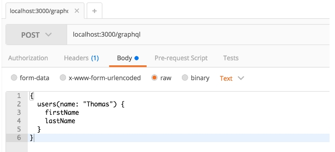
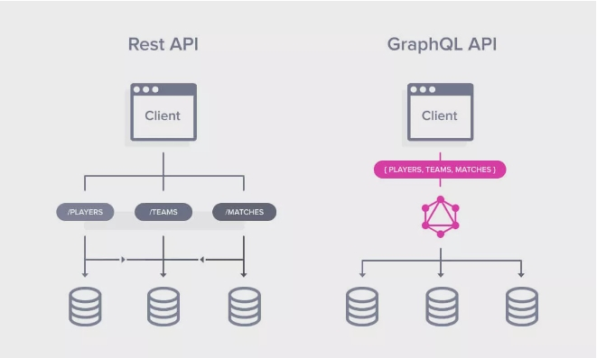

# Conociendo GraphQL

GraphQL define dos elementos:

* Un lenguaje de consulta 

* Un entorno de ejecución para responder a estas consultas a través de la especificación de un esquema tipado en el que se enlistan los datos que el servicio web puede entregar y las operaciones para dar respuesta a las solicitudes de los clientes. 

GraphQL permite que los desarrolladores creen consultas para extraer datos de varias fuentes en una sola llamada a la API.

# GraphQL vs REST

La principal diferencia entre las dos arquitecturas es que GraphQL es independiente de la base de datos y funciona mediante la creación de un único endpoint responsable de aceptar las consultas, en lugar de basarse en el enfoque de la API REST de tener endpoints separados para cada servicio. 

GraphQL es un lenguaje orientado al cliente. Tiene una arquitectura en la que la aplicación front-end decide qué datos obtener y cuánto debe devolver el servidor. Mientras tanto, al usar REST, todo está diseñado en el servidor, por lo que el servidor impulsa la arquitectura.

No hay problemas de over-fetching y under-fetching. Una ventaja de GraphQl sobre REST es que las respuestas REST contienen demasiados datos o a veces no los suficientes, lo que crea la necesidad de otra solicitud. GraphQL resuelve este problema obteniendo sólo los datos exactos y específicos en una única solicitud.

Pero esto no es una rivalidad, pueden ser complementarios! la manera en la que el entorno de ejecución que resuelve las queries puede acceder a cualquier tipo de fuente de datos, como lo puede ser un ORM de una base de datos o llamadas a API de 3ros.

# ¿Por qué y cuándo usar GraphQL?

Una buena situación para usar GraphQL es cuando:

* Su aplicación necesita manejar un gran número de consultas y mutaciones diferentes, y una API REST tradicional sería difícil de administrar.
* Su aplicación necesita manejar una variedad de tipos de datos diferentes, y un esquema GraphQL permite una mejor organización y documentación de los datos.
* Su aplicación del lado del cliente necesita tener un control preciso sobre los datos que recibe del servidor, y GraphQL permite mayor flexibilidad en la recuperación y consulta de datos.
* Su aplicación va a ser utilizada por otros desarrolladores o sistemas de terceros y desea proporcionarles una API clara y bien documentada.
* Su aplicación necesita manejar actualizaciones en tiempo real y suscripciones, GraphQL proporciona soporte nativo para las suscripciones que puede ayudarte a implementar esta característica.

Razones para usar GraphQL:

* Flexibilidad: permite al cliente solicitar solo los datos específicos que necesita, evitando la sobrecarga o subestimación de datos.
* Tipado fuerte: GraphQL proporciona un esquema claro y fácil de entender, lo que permite una mejor documentación y un manejo de errores más robusto.
* Eficiente: ya que el cliente puede especificar exactamente qué datos necesita, a menudo se pueden combinar varias solicitudes en una sola solicitud.


Razones para no usar GraphQL:

* Curva de aprendizaje: GraphQL tiene una curva de aprendizaje más pronunciada que REST, y los desarrolladores pueden necesitar pasar más tiempo para familiarizarse con él.
* Caching: GraphQL no tiene mecanismos de almacenamiento en caché incorporados, lo que puede hacer más difícil almacenar en caché las respuestas del servidor.
* Sobrecarga: si el cliente especifica demasiados datos en su solicitud, puede acabar sobrecargando, lo que puede generar problemas de rendimiento.

# Pros y contras
Pros
* GraphQL es mucho más rápido que otras API de comunicación porque le facilita reducir las requests eligiendo sólo los campos específicos que desea consultar.
* Sistemas complejos y microservicios. Podemos integrar múltiples sistemas detrás de la API de GraphQL. Los unifica y oculta su complejidad. El servidor GraphQL también se utiliza para obtener datos de los sistemas existentes y empaquetarlos en el formato de respuesta GraphQL. Esto es muy beneficioso para las infraestructuras heredadas o las API de terceros que tienen un tamaño enorme y son difíciles de mantener y manejar. Cuando tenemos que migrar de una aplicación backend monolítica a una arquitectura de microservicios, la API GraphQL puede ayudarnos a gestionar la comunicación entre múltiples microservicios fusionándose en un esquema GraphQL.
* Define una forma de datos: Cuando hacemos request GraphQL al servidor, éste devuelve la respuesta en una forma simple, segura y predecible. Así, te facilita escribir una consulta específica de acuerdo a tu requerimiento.
* Código compartido: Podemos compartir los campos GraphQL utilizados en múltiples consultas a un nivel de componente superior para su reutilización. Esta característica se conoce como fragmentos y permite obtener datos diferentes manteniendo el mismo campo de esquema.
* GraphQL es un lenguaje fuertemente tipado donde cada nivel de una consulta GraphQL corresponde a un tipo particular, y cada tipo describe un conjunto de campos disponibles. Por lo tanto, es similar a SQL y proporciona mensajes de error descriptivos antes de ejecutar una consulta.
* Introspection: Podemos consultar un servidor GraphQL por sus tipos de soporte. Crea una potente plataforma para herramientas y software cliente como el framework, Relay, o IDEs como GraphiQL. GraphiQL facilita a los desarrolladores aprender y explorar una API rápidamente.
* No se requiere la última versión. En GraphQL, el conjunto de resultados o datos devueltos es muy específico según la consulta del cliente, por lo que; es muy simple y fácil para el servidor generalizarlo. Cuando añadimos nuevas características de producto, campos adicionales al servidor, no afectan a los clientes existentes. Usted puede utilizar el servidor anterior sin ninguna preocupación porque los campos del servidor pueden ser obsoletos pero siguen funcionando. Este proceso compatible no requiere la necesidad de un número de versión creciente. Puedes ver que Facebook está utilizando la misma versión de GraphQL API en sus aplicaciones.

Contras
* Las consultas siempre devuelven un código de estado HTTP de 200, independientemente de si la consulta se ha realizado correctamente o no. Si la consulta no tiene éxito, su respuesta JSON tendrá una clave de “errors:” de nivel superior con mensajes de error asociados y stacktrace. Esto puede hacer que sea mucho más difícil hacer la gestión de errores.
* Según su implementación, GraphQL podría requerir estrategias de gestión de API diferentes a las API de REST, sobre todo si se tienen en cuenta los precios y los límites de frecuencia.
* La flexibilidad y riqueza del lenguaje de consulta también añade complejidad que puede no valer la pena para APIs mas sencillas.

# Ejemplo básico:
Para este ejemplo vamos a estar utilizando la librería de [apollo](https://www.apollographql.com/docs/)  que nos brinda en este caso un cliente para react y un servidor para nodeJS
El schema definido será uno muy simple de un blog donde los usuarios pueden tener posts asociados

```typescript
type User {
  id: ID!
  name: String!
  lastName: String!
  emails: [String!]
  age: Int!
  posts: [Post]
}

type Post {
  id: ID!
  title: String!
  content: String!
}

type Query {
  user(id: ID!): User
  post(id: ID!): Post
  allUsers: [User]
  allPosts: [Post]
}
```
Server:
```javascript
const { ApolloServer, gql } = require('apollo-server');


// Definir tipos de datos y resolvers
const typeDefs = gql`
 type User {
   id: ID!
   name: String!
   lastName: String!
   emails: [String!]
   age: Int!
   posts: [Post]
 }
 type Post {
   id: ID!
   title: String!
   content: String!
 }
 type Query {
   user(id: ID!): User
   post(id: ID!): Post
   allUsers: [User]
   allPosts: [Post]
 }
`;


const users = [
 { name: 'John', lastName: 'Doe', emails: ['johndoe@example.com'], age: 30 },
 { name: 'Jane', lastName: 'Doe', emails: ['janedoe@example.com'], age: 25 },
];


const posts = [
 { id: '1', title: 'My first post', content: 'This is my first post' },
 { id: '2', title: 'My second post', content: 'This is my second post' },
];


const resolvers = {
 Query: {
   // En los resolvers podriamos hacer una llamada a una api de 3ros
   user: (_, { id }) => users.find((user) => user.id === id),
   post: (_, { id }) => posts.find((post) => post.id === id),
   allUsers: () => users,
   allPosts: () => posts,
 },
};


// Creamos la instancia del servidor
const server = new ApolloServer({ typeDefs, resolvers });

// Inicializamos el servidor
server.listen().then(({ url }) => {
 console.log(`Server ready at ${url}`);
});

```
Cliente de react
```javascript
import React from 'react';
import { ApolloClient, ApolloProvider, gql, useQuery } from '@apollo/client';


const client = new ApolloClient({
 uri: 'http://localhost:4000/graphql',
});


function User({ id }) {
 const { loading, error, data } = useQuery(gql`
   query User($id: ID!) {
     user(id: $id) {
       name
       lastName
       emails
       age
     }
   }
 `, { variables: { id } });


 if (loading) return <p>Loading...</p>;
 if (error) return <p>Error :(</p>;


 return (
   <div>
     <h2>{data.user.name} {data.user.lastName}</h2>
     <p>Age: {data.user.age}</p>
     <p>Emails: {data.user.emails.join(', ')}</p>
   </div>
 );
}


function App() {
 return (
   <ApolloProvider client={client}>
     <User id="1" />
   </ApolloProvider>
 );
}


export default App;
```
En este ejemplo, el componente User utiliza el hook useQuery de react-apollo para consultar al servidor un usuario específico por ID. El componente ApolloProvider se utiliza para proporcionar la instancia de cliente a toda la aplicación React. Cuando el componente es renderizado

# Algunos extras:

GraphQL fue desarrollado internamente por Facebook en 2012 antes de ser liberado públicamente en 2015. ​ El 7 de noviembre de 2018, el proyecto GraphQL fue transferido de Facebook a la recién establecida Fundación GraphQL, alojada por la Fundación Linux.

Los servidores de GraphQL están disponibles para múltiples lenguajes, incluyendo Haskell, Javascript, Perl, Python, Ruby, Java, C++,11​ C#, Scala, Go, Rust, Elixir, Erlang, PHP, R, y Clojure.

Documentación oficial de GraphQL: https://graphql.org/learn/
Documentación oficial de Apollo: https://www.apollographql.com/docs/